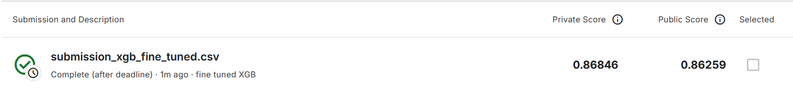
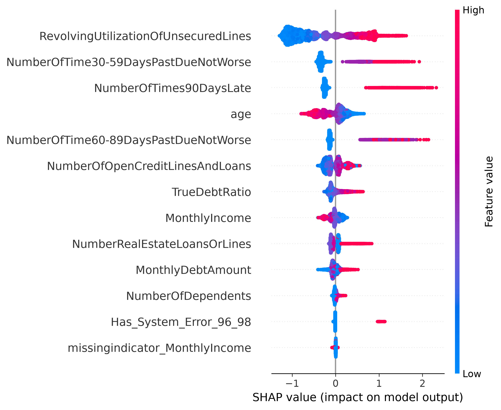

# Moteur de Scoring de Crédit : Prédiction du Risque de Défaut

**1. Contexte du projet**

Dans ce projet, l'objectif principal est de concevoir un algorithme capable d'évaluer la probabilité qu'un emprunteur se retrouve en situation de défaut de paiement dans un horizon de deux ans. Ce travail s'appuie sur le jeu de données issu de la compétition Kaggle [Give Me Some Credit de Kaggle](https://www.kaggle.com/competitions/GiveMeSomeCredit/data). Il convient non seulement de maximiser le pouvoir discriminant du modèle, mais également de garantir une transparence totale des décisions algorithmiques pour répondre aux exigences d'audit du secteur bancaire.

**2. Architecture et Méthodologie**

Notre démarche s'articule autour d'une progression logique, documentée au sein des carnets de recherche fournis :

* **Prétraitement et Feature Engineering :** Traitement des valeurs manquantes par imputation itérative, plafonnement des valeurs extrêmes aberrantes et création de variables métier pertinentes (isolation des codes d'erreur système, scission claire de la charge de dette mensuelle et du taux d'effort).
* **Modèle de référence (Baseline) :** Mise en place d'une Régression Logistique pénalisée au sein d'une pipeline Scikit-Learn orientée objet, permettant d'établir un socle de performance de référence.
* **Modélisation avancée (XGBoost) :** Entraînement et optimisation des hyperparamètres d'un algorithme non linéaire sous validation croisée (RandomizedSearchCV). Cette étape a permis de capter les interactions complexes du jeu de données tout en instaurant une régularisation stricte pour prévenir le surapprentissage.

**3. Évaluation des Performances**

Le remplacement du modèle linéaire par notre architecture XGBoost optimisée a justifié son intégration par un gain de performance net. La soumission sur la plateforme d'évaluation officielle confirme cette progression avec les résultats suivants :

* Score AUC-ROC (Test Privé) : 0.868
* Coefficient de Gini équivalent : 73.30%

  

**4. Audit et Explicabilité (SHAP)**

Afin de pallier le manque de transparence intrinsèque aux modèles d'arbres boostés, la méthode SHAP a été intégrée pour valider la cohérence financière des décisions prises par l'algorithme :

* L'analyse globale démontre que l'utilisation excessive des lignes de crédit renouvelable et l'accumulation de retards de paiement (notamment au-delà de 90 jours) constituent logiquement les facteurs de risque dominants.
* À l'inverse, l'âge avancé de l'emprunteur est correctement identifié par le modèle comme un signal de stabilité réduisant la probabilité de défaut.

  

**5. Déploiement de l'Interface**

Pour rendre ce moteur de scoring directement exploitable par un conseiller bancaire ou un auditeur, une interface interactive a été mise en production via Streamlit. Elle met à disposition :

* Un simulateur individuel permettant de calculer le risque d'un prospect en temps réel, justifié par un graphique d'explicabilité locale décomposant mathématiquement le motif de refus ou d'acceptation.
* Un module de scoring par lot conçu pour analyser un portefeuille client complet via l'import d'un fichier CSV, générant un rapport formaté prêt à être exporté.

**6. Instructions d'exécution locale**

Pour déployer et tester l'application sur un environnement local, il convient d'exécuter les commandes suivantes à la racine du projet :

1. Installer les dépendances requises :
`pip install -r requirements.txt`
2. Lancer le serveur d'application :
`streamlit run app.py`

L'application s'ouvrira automatiquement dans le navigateur et un fichier `sample_clients.csv` est fourni dans le dossier `data/` pour tester l'évaluation par lot de manière autonome.